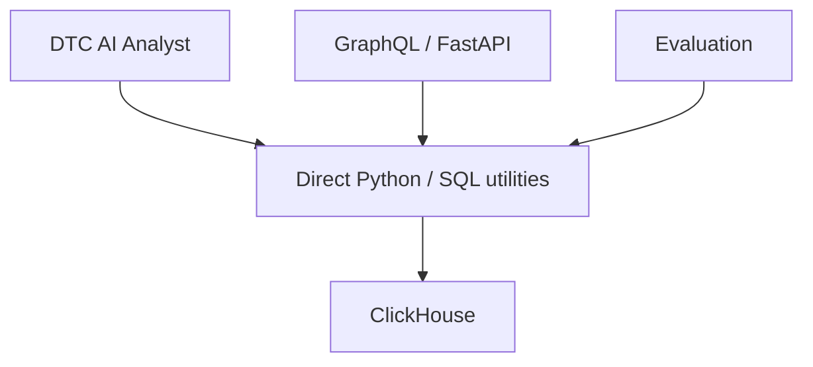
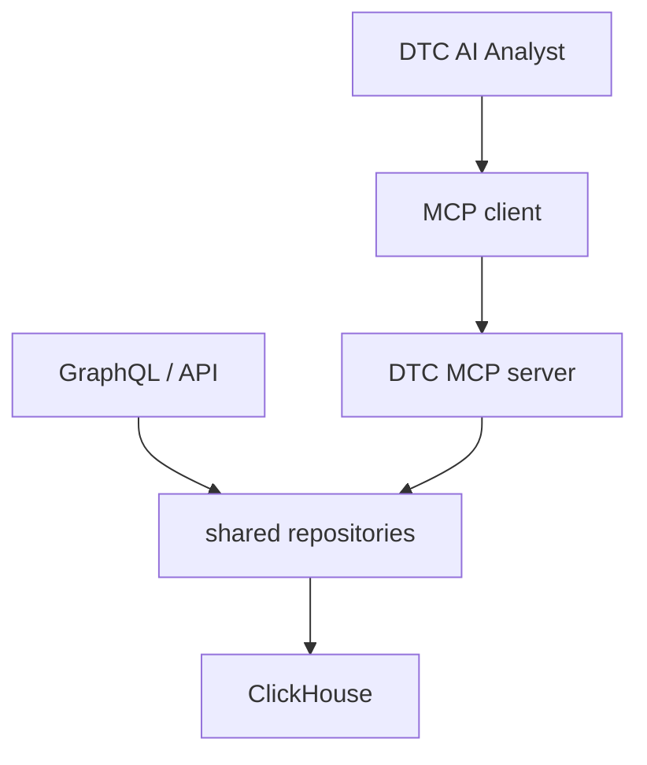

# Current DTC data-access architecture

## Scope and evidence

This assessment covers the active Python backend, AI Analyst, GraphQL resolvers, evaluation entry points, React calls, Docker files, dependency manifests, and the in-repository Airflow DAG contract. Generated bundles, `dist`, evaluation artifacts, caches, and `node_modules` were excluded as application source.

Live read-only `DESCRIBE TABLE` verification was completed on 2026-07-15 over ClickHouse HTTP using the existing runtime configuration without printing endpoint or credential values. The deployed contracts were cross-checked against `src/clickhouse_utils_v2.py`, `src/schema_registry.py`, `docs/rag/data-dictionary.md`, and actual SQL projections. The live schema shows `clientLoginId` on all tenant-bearing analytical aggregates; parts of the repository schema registry/data dictionary are stale where they say customer scope is unavailable.

## Current flow

The React frontend calls `/graphql` for dashboards and `/api/ai/chat` for the analyst. It sends `customer_name` as request/page context. FastAPI does not authenticate that customer. The AI Analyst constructs and executes SQL through `get_clickhouse_client`; GraphQL repeats SQL in each resolver through `_query_rows`.

## Direct database-access inventory

| Caller | File/function | Tables/query type | Scope and binding | Limits/timeouts/errors/cache/observability | Reuse assessment |
|---|---|---|---|---|---|
| AI domain tools and generic SQL | `src/ai_analyst.py`: `_exec_sql`, `_safe_exec`, `_tool_get_*`, `run_sql` handler | All `*_ravi_v2` analytical/fact tables; generated and static SELECT/WITH | `customer_name`, vehicle, and DTC come from model-visible request context/tool args. SQL is rendered by string-literal replacement in the HTTP adapter. | Adds a 500-row outer limit only when no textual `LIMIT`; HTTP receive timeout 60s, native client has no explicit query timeout/read-only setting. `_safe_exec` returns errors and emits SQL trace events. `QUERY_CACHE` caches generated SQL, not results. | Tool contracts and schema registry are reusable concepts; execution, tenant enforcement, SQL parsing, and repositories require refactoring. |
| GraphQL dashboards | `src/graphql_schema.py`: `_query_rows` and all `Query` resolvers | Resolver-specific SELECTs over vehicle, fault, DTC, fleet, maintenance, trend and co-occurrence tables | Optional `customer_name` is a GraphQL argument. `_customer_and` filters native `customer_name`; `_customer_client_and` maps through `vehicle_master.clientLoginId`. Several lookup/global resolvers have no customer input. | Per-resolver `LIMIT` is inconsistent; no common maximum or query timeout; exceptions propagate through GraphQL; no explicit cache or query tracing. | Business queries should move to shared repositories while preserving GraphQL output types and field behavior. |
| API startup health | `src/api_server.py:_init_db` | `SELECT 1` | No tenant relevance | Connection exception is logged; no cache. | Keep as infrastructure health, outside domain MCP tools. |
| Conversation persistence | `src/conversation_store.py` | DDL, INSERT, SELECT on `ai_conversations`, `ai_conversation_messages` | Conversation/customer comparison prevents reuse of an existing conversation ID under a different supplied customer, but the supplied customer itself is unauthenticated. Values use driver-style params/list rows. | Recent messages limited; storage errors can fail chat setup. | Keep separate from read-only DTC repositories; add authenticated scope at API boundary. |
| Observability persistence | `src/observability_store.py` | DDL/ALTER/INSERT/SELECT on `ai_obs_*` | Records supplied customer/mode | Best-effort wrapper exists; raw query text can contain sensitive operational identifiers. | Reuse the event model, but add MCP call identity, redaction, duration, row count, and outcome. |
| LangSmith sync | `src/langsmith_sync.py` | checkpoint and observability SELECT/INSERT | Operational, not product tenant enforcement | Has polling/checkpoint behavior. | Keep outside MCP domain data path. |
| Evaluation catalog grounding | `evaluation/generate_session_catalog.py:fetch_grounding`, `fetch_fleet_customers` | SELECT from `vehicle_fault_master` and `vehicle_health_summary` | Customer filter is parameterized; customer enumeration is intentionally global for dataset generation. | Limits 12 and configurable customer limit; catches failures and falls back. | Evaluation should consume public client/repository contracts where practical, but catalog administration remains privileged. |
| Evaluation runners | `evaluation/run_evaluation.py`, `evaluation/conversational_runner.py` | Calls AI function/API; evaluates captured SQL events | Default customer is config/input, not an authenticated identity. | API health/call timeouts exist; validation detects missing scope and forbidden customer names. | Reuse as migration/regression harness; add direct/shadow/MCP comparisons. |
| Streamlit evaluation/ops UI | `streamlit_app.py` | Direct SELECTs on observability/evaluation tables | Operational UI, not DTC domain tenancy | Multiple explicit queries and some limits; direct errors handled in UI paths. | Keep as operational reporting; do not route through runtime DTC MCP by default. |
| Ingest/pipeline support | `src/vehicle_ingest.py`, `src/episode_detection.py`, `dags/dtc_analytics_pipeline.py` | DESCRIBE/SELECT/INSERT and pipeline validation counts | Producer/ETL responsibility; source uses `clientLoginId` and `customer_name` mappings | Separate Airflow virtualenv/runtime. DAG imports `src.analytics_pipeline_v2_sql`, absent from this snapshot. | Explicitly outside MCP runtime and must not be moved. |

## GraphQL query surface

Customer-scoped dashboard resolvers include fleet KPIs/overview/trends, risk vehicles, DTC summaries/trends/affected vehicles, selected-DTC views, vehicle faults/timeline, maintenance, and some fleet aggregates. Global or identifier-only surfaces include `customer_names`, `customer_overview`, `vehicle_overview`, `vehicle_health_detail`, `dtc_detail`, `dtc_fleet_impact`, and `dtc_cooccurrence`; arguments alone are not authorization.

Notably, `dtc_fleet_impact` and `dtc_cooccurrence` accept a `customer_name` argument but ignore it and query all `clientLoginId` partitions despite the deployed tables having that tenant-bearing column. The AI tools avoid those aggregates when a customer is supplied by recomputing from `vehicle_fault_master`, which duplicates GraphQL logic and produces different semantics.

## Duplication and proposed shared boundary

Duplicated business logic exists for fleet health, fleet/DTC distributions, fault trends, vehicle health/fault detail, maintenance priority, system health, co-occurrence, and DTC impact in `src/ai_analyst.py` and `src/graphql_schema.py`. Customer-filter fragments, result shaping, limits, and joins are reimplemented separately.

GraphQL should call shared repositories directly, not MCP. The AI should call MCP in `mcp` mode and retain direct mode only as an explicit rollback path during migration.

## Existing test baseline

- No unit, integration, GraphQL, AI-tool, SQL, tenant-isolation, or frontend test files were found.
- No CI workflow/configuration was found.
- `python -m compileall -q src evaluation` passes. Full runtime imports/integration cannot run because runtime dependencies are not installed in the active interpreter.
- Frontend has `dev`, `build`, and `preview` scripts but no test script. Its Vite production build passes to an isolated output directory, with a pre-existing large-chunk warning.
- Existing evaluation suites provide behavioral scoring and scope heuristics, not deterministic security tests.

## Environment and deployment observations

- No application `.env.example` existed during the brownfield assessment; the real `.env` values were not printed or modified. Taskmaster initialization later created a placeholder-only `.env.example` for AI-provider keys.
- Dockerfiles and `docker-compose.yml` define the API, frontend, MLflow, and LangSmith sync services. Docker CLI is not installed in the current host shell, so container baselines were not run.
- Airflow remains a separate virtualenv/deployment contract under `dags/`; its paths were not changed.
